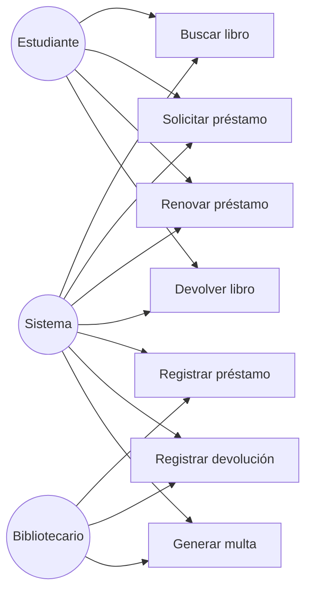

# Diagrama de casos de uso

Este diagrama representa las funcionalidades del sistema desde la perspectiva de los usuarios. Se observa que el estudiante puede buscar libros, solicitar préstamos y devolverlos, mientras que el bibliotecario administra los préstamos, las devoluciones y las multas. La importancia del caso de uso radica en mostrar qué hace el sistema y quiénes participan en cada actividad, sin entrar aún en detalles de implementación.

