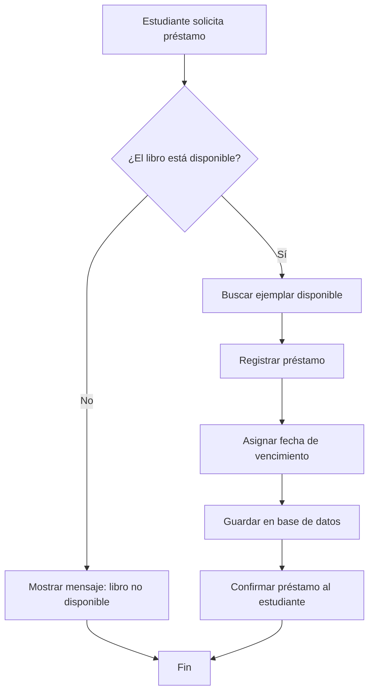

# Diagrama de flujo de actividad

Este diagrama describe el flujo principal de una operación del sistema: el usuario solicita un préstamo, el sistema verifica la disponibilidad del libro y decide si permite o rechaza la acción. Muestra de manera clara la lógica del proceso, las decisiones que se toman y el camino alternativo cuando el recurso no está disponible. Es una vista útil para entender el comportamiento funcional del sistema.

