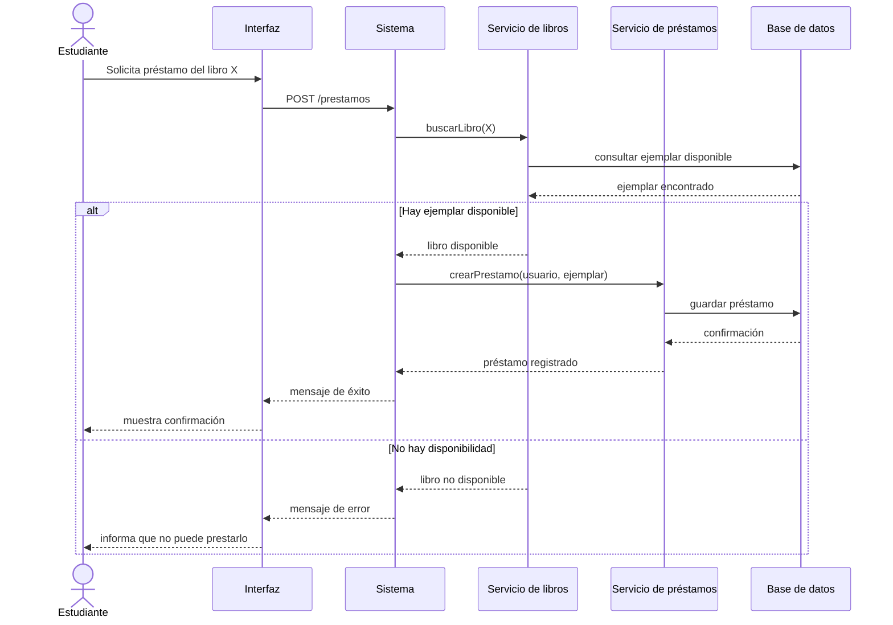

# Diagrama de secuencia

Este diagrama muestra la secuencia de mensajes entre los distintos componentes del sistema en el momento de realizar un préstamo. Se puede ver cómo se comunica la interfaz con el sistema, cómo se consulta la disponibilidad del libro y cómo se registra la operación en la base de datos. Es especialmente útil para comprender el orden temporal de las acciones y la dependencia entre los módulos del sistema.

