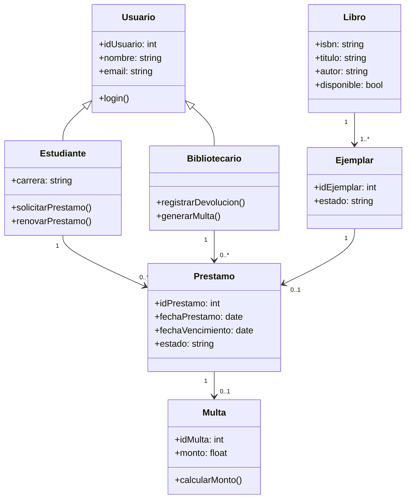

# Diagrama de clases

Este diagrama presenta la estructura estática del sistema mediante clases y relaciones. Se identifica la jerarquía entre Usuario, Estudiante y Bibliotecario, así como la relación entre Libro, Ejemplar y Prestamo. También se incorpora la clase Multa para representar la penalización por retraso. Este tipo de diagrama permite entender cómo están organizadas las entidades del sistema y cómo interactúan entre sí.

