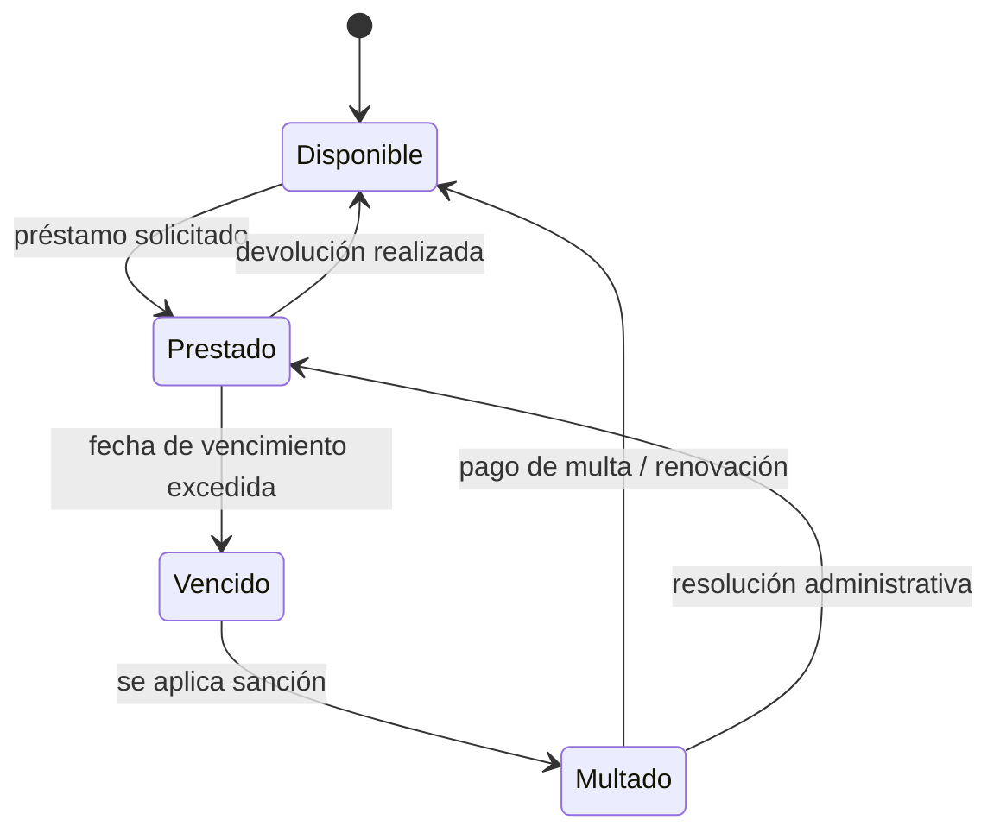

# Diagrama de estados

Este diagrama describe cómo cambia el estado de un ejemplar o préstamo a lo largo del tiempo. Un libro puede pasar de disponible a prestado, luego a vencido y eventualmente a multado si no se devuelve a tiempo. Permite visualizar el comportamiento dinámico del sistema y entender cómo se modelan los cambios de estado de un recurso en distintas condiciones.

