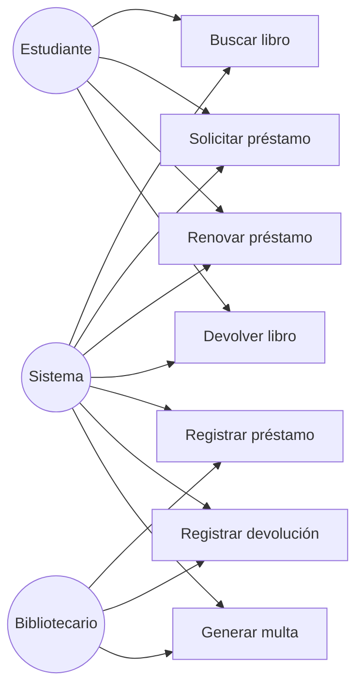
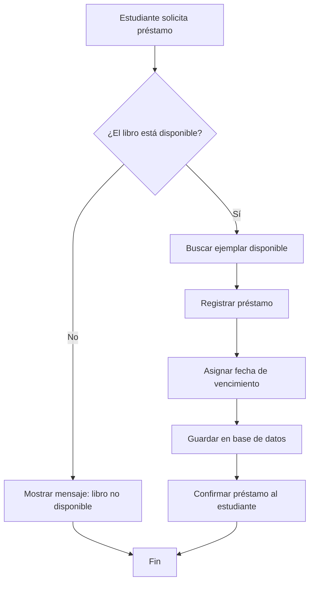
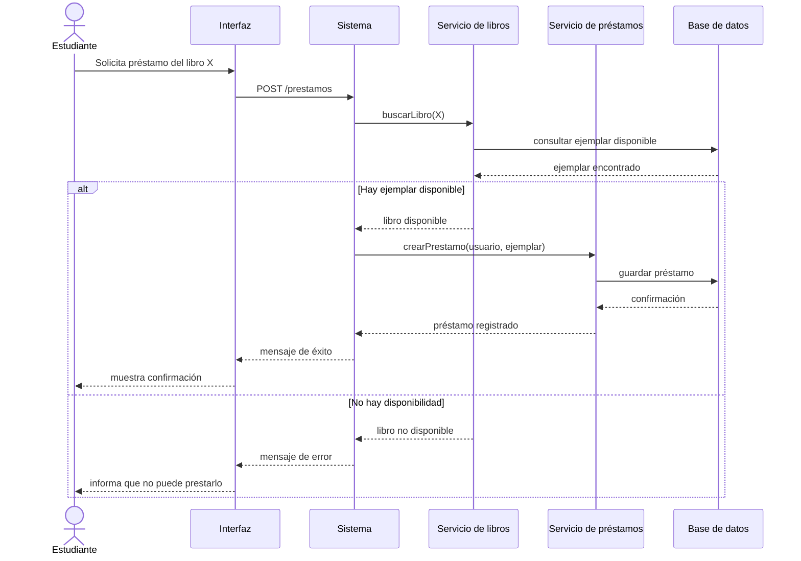
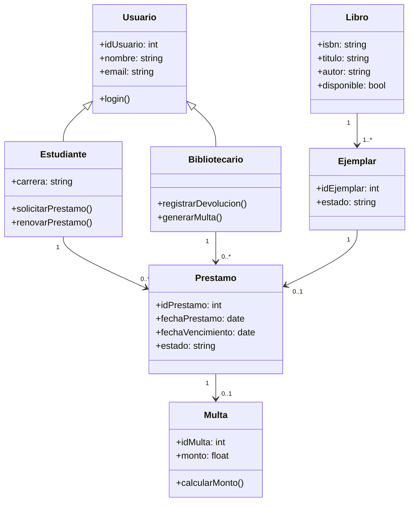
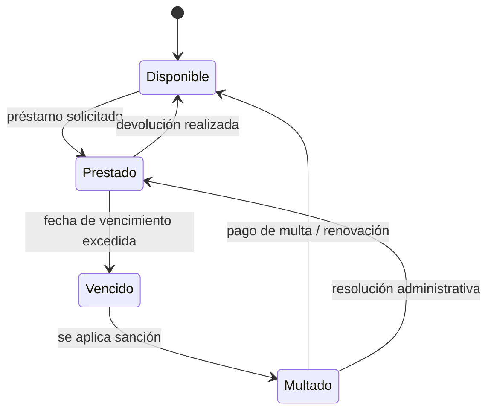

# Sistema de préstamo de libros

El siguiente ejemplo describe un sistema simple de biblioteca universitaria. El objetivo es mostrar cómo se puede representar un mismo problema desde distintas perspectivas del análisis y diseño de software.

En este sistema, un estudiante puede buscar libros, solicitar préstamos y devolverlos. Un bibliotecario administra los préstamos y, en caso de retraso, se registra una multa. El sistema valida la disponibilidad del ejemplar y mantiene el estado del préstamo.

---

## Diagrama de casos de uso

Este diagrama representa las funcionalidades del sistema desde la perspectiva de los usuarios. Se observa que el estudiante puede buscar libros, solicitar préstamos y devolverlos, mientras que el bibliotecario administra los préstamos, las devoluciones y las multas. La importancia del caso de uso radica en mostrar qué hace el sistema y quiénes participan en cada actividad, sin entrar aún en detalles de implementación.

---

## Diagrama de flujo de actividad

Este diagrama describe el flujo principal de una operación del sistema: el usuario solicita un préstamo, el sistema verifica la disponibilidad del libro y decide si permite o rechaza la acción. Muestra de manera clara la lógica del proceso, las decisiones que se toman y el camino alternativo cuando el recurso no está disponible. Es una vista útil para entender el comportamiento funcional del sistema.

---

## Diagrama de secuencia

Este diagrama muestra la secuencia de mensajes entre los distintos componentes del sistema en el momento de realizar un préstamo. Se puede ver cómo se comunica la interfaz con el sistema, cómo se consulta la disponibilidad del libro y cómo se registra la operación en la base de datos. Es especialmente útil para comprender el orden temporal de las acciones y la dependencia entre los módulos del sistema.

---

## Diagrama de clases

Este diagrama presenta la estructura estática del sistema mediante clases y relaciones. Se identifica la jerarquía entre Usuario, Estudiante y Bibliotecario, así como la relación entre Libro, Ejemplar y Prestamo. También se incorpora la clase Multa para representar la penalización por retraso. Este tipo de diagrama permite entender cómo están organizadas las entidades del sistema y cómo interactúan entre sí.

---

## Diagrama de estados

Este diagrama describe cómo cambia el estado de un ejemplar o préstamo a lo largo del tiempo. Un libro puede pasar de disponible a prestado, luego a vencido y eventualmente a multado si no se devuelve a tiempo. Permite visualizar el comportamiento dinámico del sistema y entender cómo se modelan los cambios de estado de un recurso en distintas condiciones.

---

En conjunto, el ejemplo muestra que un mismo sistema puede describirse con distintos diagramas según la dimensión que se quiera analizar: actors y funcionalidades, flujo de proceso, orden temporal de mensajes, estructura de clases y evolución de estados. La combinación de estas vistas permite comprender mejor tanto el comportamiento del sistema como su organización interna.
